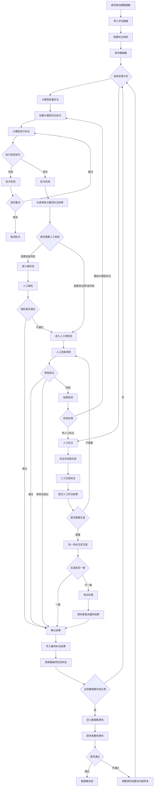

# 大模型标注业务流程说明

本文档用于说明在现有数据标注系统中引入大语言模型标注能力后的业务思路。本文只描述业务逻辑和流程边界，不涉及详细架构设计、数据库表设计或接口设计。

## 1. 背景与目标

现有系统以人工标注为主，包含数据集创建、数据导入、任务领取、人工标注、互查、争议处理和提供者审核等流程。

对于社交媒体评论数据，例如 B 站、小红书评论中的“正常文本 / 数字泔水”分类任务，评论文本短、规则明确、输出结构固定，大语言模型适合作为主要标注生产力参与业务流程。

引入大模型标注的目标不是简单替代所有人工，而是将人工从逐条生产标注结果，转向审核、质检、规则校准和争议裁决。

推荐业务定位为：

```text
大模型主标注 + 人工质检审核
```

## 2. 适用任务类型

大模型适合参与以下类型的标注任务：

- 短文本分类
- 社交媒体评论质量识别
- 内容安全审核类标注
- 垃圾信息、辱骂、引战、低俗、暴力等类别识别
- 输出结果固定、标签体系清晰的结构化标注任务

以“数字泔水”任务为例，大模型需要判断：

- 主分类：`normal` 或 `digital_swill`
- 子类别：当主分类为 `digital_swill` 时，进一步判断为：
  - `pornographic`
  - `violent`
  - `inflammatory`
  - `personal_attack`
  - `low_quality`
  - `other_violation`

## 3. 大模型在业务中的角色

大模型不建议作为普通“标注员账号”混入人工领取任务流程。

人工流程适合：

- 领取任务
- 打开工作台
- 逐条阅读
- 手动选择标签
- 保存草稿
- 提交任务单
- 根据反馈修改

大模型流程更适合：

- 批量读取数据项
- 批量读取标注规则
- 批量生成结构化标注结果
- 给出置信度和标注理由
- 标记低置信度或边界样本
- 将结果交给人工抽检或审核

因此，大模型应有独立的批量标注流程，但产出的结果需要进入现有的审核、争议和数据集完成流程。

## 4. 核心业务流程

新版业务流程可以理解为两条生产路径汇入同一个质量控制闭环：

- 人工标注路径：人工领取任务并提交标注结果。
- 大模型标注路径：提供者发起大模型批量标注，大模型产出结构化结果。

最终结果都需要进入人工质检、审核或争议处理，确认后才成为数据项的最终标注结果。



## 5. 大模型标注批次

大模型标注应以“批次”为单位运行，而不是像人工一样领取任务单。

一个大模型标注批次表示：系统使用指定的数据集、标注规则和模型配置，对一批数据项执行自动标注。

批次应表达以下业务信息：

- 标注的数据集
- 使用的标注规则
- 使用的大模型
- 处理的数据量
- 成功数量
- 失败数量
- 当前执行状态
- 执行结果是否需要人工介入

第一版批次状态建议保持简单：

```text
pending -> running -> completed
              ↓
            failed
              ↓
          cancelled
```

状态含义：

- `pending`：批次已创建，尚未开始执行。
- `running`：大模型正在执行标注。
- `completed`：大模型已完成本批次处理，不代表所有结果最终通过。
- `failed`：批次执行失败，例如模型调用失败或输出异常过多。
- `cancelled`：人工取消批次。

## 6. 单条大模型标注结果

大模型对每条评论产出一条标注结果。

建议单条结果包含：

- 主分类
- 子类别
- 标注理由
- 置信度
- 是否需要人工审核

示例：

```json
{
  "content": "你就是个傻逼",
  "main_category": "digital_swill",
  "sub_category": "personal_attack",
  "confidence": "high",
  "confidence_score": 0.95,
  "reason": "包含直接人身辱骂，属于人身攻击",
  "needs_human_review": false
}
```

单条结果状态建议为：

```text
ai_labeled -> accepted
          -> needs_review
          -> rejected
```

状态含义：

- `ai_labeled`：大模型已产出标注结果。
- `needs_review`：结果需要人工审核。
- `accepted`：结果已被确认，可以作为最终结果。
- `rejected`：结果被人工驳回，需要重标或转人工处理。

## 7. 置信度的业务含义

置信度不是严格意义上的真实概率，而是用于审核分流的可信程度。

它的主要作用是决定人工审核强度：

- 高置信度：进入抽检池。
- 中置信度：提高人工审核比例。
- 低置信度：进入人工逐条审核。
- 高风险类别：即使模型置信度较高，也建议进入人工审核。

置信度可以分为三档：

- `high`：规则命中明确，类别边界清晰，基本不依赖上下文。
- `medium`：大方向明确，但子类别或语境存在一定不确定性。
- `low`：依赖上下文、含黑话缩写、反讽、类别边界不清或模型理由不充分。

示例：

| 评论 | 标注结果 | 置信度 | 原因 |
| --- | --- | --- | --- |
| 你就是个傻逼 | `digital_swill / personal_attack` | 高 | 直接辱骂，规则明确 |
| 南方人就是不如北方人 | `digital_swill / inflammatory` | 高 | 地域对立明确 |
| 这里面的女演员身材真好 | 可能正常，也可能低俗 | 中/低 | 依赖语境和规则严格程度 |
| [笑哭][笑哭][笑哭][笑哭] | `digital_swill / low_quality` | 高 | 连续表情堆砌 |
| 这波操作真下饭 | `normal` | 中 | 网络表达，通常正常但依赖语境 |

## 8. 是否需要大模型二次标注

不建议第一版对所有数据都进行两次大模型标注。

更推荐的方式是：条件触发大模型复核。

触发二次标注或复核的情况包括：

- 第一次置信度低。
- 结果属于高风险类别。
- 评论包含黑话、缩写、谐音、反讽。
- 主分类明确但子类别边界模糊。
- 大模型理由与标签不一致。
- 输出格式异常。
- 相似评论出现不一致标注。
- 抽检发现当前批次错误率偏高。

处理规则可以简化为：

- 两次一致且低风险：进入抽检池。
- 两次一致但高风险：进入人工审核池。
- 两次不一致：进入人工审核池。
- 任一次低置信度：进入人工审核池。
- 任一次结果为 `other_violation`：进入人工审核池。

## 9. 人工在大模型流程中的职责

引入大模型后，人工仍然是质量闭环中的关键角色。

人工职责从“逐条标注生产”转向：

- 抽检大模型高置信结果。
- 审核低置信度和边界样本。
- 修改大模型错误结果。
- 驳回明显错误结果。
- 裁决争议样本。
- 总结错误模式，优化标注规则。
- 对高风险类别进行最终确认。

人工不需要审核所有大模型结果，但需要覆盖风险较高和不确定性较强的样本。

## 10. 推荐第一版业务边界

第一版建议聚焦以下能力：

- 提供者可以发起大模型批量标注。
- 大模型按数据集标注规则产出结构化结果。
- 每条结果包含标签、子标签、置信度、理由和是否需要人工审核。
- 系统按置信度和风险把结果分流到抽检池或人工审核池。
- 人工审核后确认、修改或驳回结果。
- 被确认的结果进入最终标注结果。
- 被驳回的结果可以重新大模型标注或转人工标注。

第一版不建议做得过重：

- 不需要让大模型模拟人工账号领取任务。
- 不需要全量双模型互查。
- 不需要让大模型直接完成数据集。
- 不需要让大模型自动修改标注规则。
- 不需要让大模型独立裁决高风险争议。

## 11. 总结

大模型适合在当前系统中承担“批量标注执行器”的角色。

推荐业务模式是：

```text
大模型负责规模化产出标注结果
人工负责审核、抽检、纠偏和最终质量确认
```

这样既能显著提升评论标注效率，又能保留人工对高风险、低置信度和争议样本的控制权。
