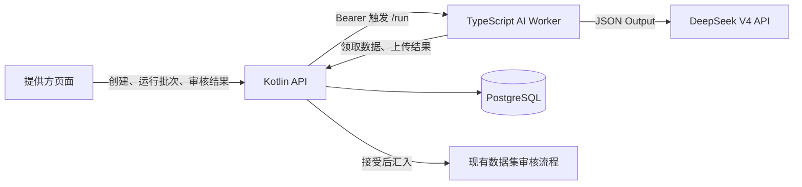

# 大模型标注第一版设计方案

## 1. 文档目的

本文档定义数据标注系统第一版大模型标注能力的设计边界、领域模型、状态机、接口、Worker 技术方案、前端职责和质量保障要求。

后续实现以本文档作为设计基线，以 [大模型标注第一版实现步骤](./大模型标注第一版实现步骤.md) 作为执行计划。若实现过程中需要改变本文档中的关键设计，必须先更新设计方案，再调整实现步骤。

## 2. 已确认决策

- 模型服务使用 DeepSeek V4，通过 OpenAI-compatible Chat Completions API 调用。
- 默认模型使用 `deepseek-v4-flash`，困难批次可通过环境变量或批次配置切换为 `deepseek-v4-pro`。
- 使用 DeepSeek JSON Output，并在 Worker 中进行第二层 JSON Schema 和业务规则校验。
- 第一版关闭思考模式、使用非流式请求，优先保证批量分类的稳定性和顺序一致性。
- 数据库变更以可直接执行的 PostgreSQL `ALTER TABLE`、`CREATE TABLE`、`CREATE INDEX` 命令交付，不引入数据库迁移框架。
- pnpm 使用仓库根目录 `package.json` 当前声明的版本，不升级或降级。
- Worker 使用 TypeScript 和 Node.js，作为 `apps/ai-worker` 独立 workspace 应用。
- Worker 不直接访问数据库、不模拟人工账号、不写入人工任务表。
- Worker 以常驻 HTTP 服务接收后端派发，提供方可在前端运行指定批次；CLI 指定 `batchId` 的方式保留为备用。
- AI 结果不会自动成为最终结果。提供方完成审核或抽检确认后，结果才写入 `data_items.final_result`。

## 3. 第一版目标

第一版必须形成以下完整闭环：

```text
提供方创建 AI 标注批次
  -> 后端锁定 pending 数据项
  -> 提供方点击运行，后端派发常驻 Worker
  -> Worker 领取数据并调用 DeepSeek V4
  -> Worker 校验并分段上传结果
  -> 后端再次校验并进行风险分流
  -> 提供方审核、修改、转人工或重试
  -> 接受结果写入 data_items.final_result
  -> 复用现有数据集审核和完成流程
```

第一版支持：

- `content_type = text` 的文本数据。
- `annotation_schema.type = classification` 的分类标注。
- 主选项单选或多选。
- 子选项单选或多选。
- 数据集动态定义的标签和子标签，不硬编码具体业务标签。
- 置信度、风险标记、人工审核、抽检、失败重试和转人工。

## 4. 第一版非目标

- 图片、音频、视频和 JSON 内容的模型标注。
- AI 模拟标注员领取人工任务。
- AI 写入 `annotation_task_batches`、`annotation_tasks` 或 `annotations`。
- 全量双模型互查。
- AI 自动修改标注规则。
- AI 自动完成数据集。
- AI 独立裁决人工争议。
- 任务队列、优先级、多 Worker 自动调度和水平扩容。
- 在前端保存或传递 DeepSeek API Key。
- 复杂 Agent 框架、Prompt 实验平台和完整成本分析平台。

## 5. 总体架构



职责边界：

- `apps/web`：批次创建、运行触发、进度轮询、结果审核和抽检操作。
- `apps/api`：身份校验、Worker 派发、数据锁定、租约、结果校验、状态流转、计数和事务。
- `apps/ai-worker`：提供内部触发服务，读取配置、构建 Prompt、调用模型、校验模型输出、重试和上传。
- PostgreSQL：保存批次、结果、租约、审核记录和最终状态。
- DeepSeek：只负责产生候选标注结果，不决定最终业务状态。

## 6. 数据模型

### 6.1 `data_items` 扩展

在现有状态约束中增加：

```text
ai_processing
```

状态流转：

```text
pending -> ai_processing -> annotated
                |              |
                |              +-> accepted / rejected（现有提供方最终审核）
                |
                +-> pending（转人工或释放失败数据）
```

### 6.2 `ai_annotation_batches`

每一行表示一次提供方发起的大模型批量标注任务。

核心字段：

| 字段 | 类型 | 说明 |
|---|---|---|
| `id` | uuid | 批次 ID |
| `dataset_id` | uuid | 数据集 ID |
| `provider_id` | uuid | 创建批次的提供方 |
| `status` | varchar(32) | `pending/running/completed/failed/cancelled` |
| `model_provider` | varchar(64) | 第一版固定为 `deepseek` |
| `model_name` | varchar(128) | 实际模型名 |
| `prompt_version` | varchar(64) | Prompt 版本 |
| `annotation_schema_snapshot` | jsonb | 创建批次时的标注结构快照 |
| `annotation_guide_snapshot` | text | 创建批次时的标注说明快照 |
| `config` | jsonb | 阈值、抽检率、高风险选项、最大尝试次数等 |
| `total_count` | int | 批次数据项总数 |
| `processed_count` | int | 已结束模型执行的数据项数 |
| `success_count` | int | 模型成功产出结果的数据项数 |
| `failed_count` | int | 当前失败数 |
| `needs_review_count` | int | 当前强制人工审核数 |
| `accepted_count` | int | 已接受数 |
| `rejected_count` | int | 已拒绝或转人工数 |
| `model_request_count` | int | 模型请求次数 |
| `prompt_tokens` | bigint | 输入 token 汇总 |
| `completion_tokens` | bigint | 输出 token 汇总 |
| `error_message` | text | 批次级错误 |
| `started_at` | timestamptz | 首次领取时间 |
| `finished_at` | timestamptz | 模型执行结束时间 |
| `cancelled_at` | timestamptz | 取消时间，第一版预留 |
| `created_at/updated_at` | timestamptz | 创建和更新时间 |

建议约束和索引：

- 外键：`dataset_id -> datasets.id`，删除数据集时级联删除。
- 外键：`provider_id -> users.id`。
- 状态 CHECK 约束。
- 所有计数字段不得小于零。
- 索引：`(dataset_id, status, created_at)`。
- 索引：`(provider_id, status, created_at)`。

`config` 第一版结构：

```json
{
  "maxItems": 1000,
  "confidenceThreshold": 0.85,
  "samplingRatio": 0.1,
  "highRiskOptionValues": [],
  "maxAttempts": 3,
  "metadataAllowList": []
}
```

### 6.3 `ai_annotation_results`

每一行表示一个批次中一条数据项的 AI 执行和审核记录。

| 字段 | 类型 | 说明 |
|---|---|---|
| `id` | uuid | AI 结果 ID |
| `batch_id` | uuid | AI 批次 ID |
| `dataset_id` | uuid | 数据集 ID，便于查询和约束 |
| `item_id` | uuid | 数据项 ID |
| `round_no` | int | 创建批次时的数据项轮次 |
| `status` | varchar(32) | `pending/processing/ai_labeled/needs_review/accepted/rejected/failed` |
| `result` | jsonb | 标准化后的 AI 结果 |
| `accepted_result` | jsonb | 人工修改后接受的结果 |
| `result_hash` | varchar(64) | 标准化结果哈希，用于幂等冲突判断 |
| `confidence` | varchar(16) | `high/medium/low` |
| `confidence_score` | numeric(5,4) | 0 到 1 |
| `reason` | text | 模型判断理由 |
| `needs_human_review` | boolean | 后端最终计算的强制审核标记 |
| `is_sampled` | boolean | 是否命中低风险抽检 |
| `risk_flags` | jsonb | 系统风险规则命中列表 |
| `raw_output` | jsonb | 当前数据项对应的模型原始片段 |
| `error_message` | text | 单条失败原因 |
| `attempt_count` | int | 业务领取尝试次数 |
| `chunk_no` | int | Worker 上传分段编号 |
| `request_id` | varchar(80) | Worker 请求追踪 ID |
| `leased_at` | timestamptz | 领取时间 |
| `lease_expires_at` | timestamptz | 租约到期时间 |
| `reviewed_by` | uuid | 审核提供方 |
| `reviewed_at` | timestamptz | 审核时间 |
| `review_action` | varchar(32) | 审核动作 |
| `review_comment` | text | 审核意见 |
| `created_at/updated_at` | timestamptz | 创建和更新时间 |

关键约束和索引：

- 唯一约束：`(batch_id, item_id, round_no)`。
- 索引：`(batch_id, status, created_at)`。
- 索引：`(dataset_id, status)`。
- 索引：`(status, lease_expires_at)`。
- 索引：`(batch_id, request_id)`，仅用于追踪，不设置唯一约束。
- `confidence_score` 必须位于 0 到 1。
- `attempt_count` 不得小于零。

## 7. 状态机

### 7.1 批次状态

```text
pending --首次领取--> running --无 pending/processing--> completed
                           |
                           +--不可恢复的批次错误--> failed

completed --单条 reject_retry--> running
```

- `completed` 只表示模型执行阶段结束，不表示结果已经全部审核通过。
- Worker 崩溃不立即把批次置为 `failed`，租约到期后可以重新领取。
- `failed` 只用于鉴权配置错误、批次上下文无效等不可继续执行的整体错误。

### 7.2 单条结果状态

```text
pending --领取--> processing
processing --低风险--> ai_labeled
processing --强制审核--> needs_review
processing --执行失败--> failed
ai_labeled / needs_review --接受--> accepted
ai_labeled / needs_review --修改接受--> accepted
ai_labeled / needs_review / failed --转人工--> rejected
ai_labeled / needs_review / failed --重新 AI--> pending
```

### 7.3 计数口径

- `processed_count`：状态不为 `pending/processing` 的结果数。
- `success_count`：存在合法模型结果且状态不为 `failed` 的结果数。
- `failed_count`：当前状态为 `failed` 的结果数。
- `needs_review_count`：当前状态为 `needs_review` 的结果数。
- `accepted_count`：当前状态为 `accepted` 的结果数。
- `rejected_count`：当前状态为 `rejected` 的结果数。

计数在结果事务中同步刷新，并提供按明细重新计算批次计数的内部方法，避免异常中断后永久漂移。

## 8. 批次创建规则

创建批次必须在一个数据库事务中完成：

1. 校验提供方拥有数据集。
2. 校验数据集状态为 `in_progress` 或 `reviewing`。
3. 校验 schema 为第一版支持的动态分类结构。
4. 使用 `FOR UPDATE SKIP LOCKED` 按创建时间选择 `pending` 文本数据。
5. 第一版 `maxItems` 默认 1000，范围限制为 1 到 5000。
6. 将选中数据项更新为 `ai_processing`。
7. 创建批次并保存 schema、guide 和配置快照。
8. 为每条数据创建状态为 `pending` 的 AI 结果记录。
9. 没有可用数据时返回冲突，不创建空批次。

## 9. API 设计

### 9.1 提供方批次接口

```text
POST /api/provider/datasets/{datasetId}/ai-annotation-batches
GET  /api/provider/datasets/{datasetId}/ai-annotation-batches
GET  /api/provider/ai-annotation-batches/{batchId}
POST /api/provider/ai-annotation-batches/{batchId}/run
```

创建批次请求：

```json
{
  "maxItems": 1000,
  "modelName": "deepseek-v4-flash",
  "promptVersion": "classification-v1",
  "confidenceThreshold": 0.85,
  "samplingRatio": 0.1,
  "highRiskOptionValues": [],
  "metadataAllowList": []
}
```

### 9.2 Worker 接口

```text
GET  /api/ai/annotation-batches/{batchId}/items?limit=100
POST /api/ai/annotation-batches/{batchId}/results
POST /api/ai/annotation-batches/{batchId}/fail
```

领取规则：

- 原子领取 `pending` 或租约已经过期的 `processing` 结果。
- 更新为 `processing`，写入五分钟租约并增加 `attempt_count`。
- 超过 `maxAttempts` 的结果转为 `failed`，不再领取。
- 首次成功领取时将批次更新为 `running`。
- 返回规则快照、配置和数据项，不返回数据库敏感字段。

上传规则：

- 校验 Worker Token、批次、结果、数据项和轮次对应关系。
- 校验结果仍允许上传，拒绝跨批次或已审核结果覆盖。
- 对结果 JSON 做 schema 和业务校验。
- 计算标准化 SHA-256 `result_hash`。
- 相同哈希重复上传视为成功，不同哈希重复上传返回 409。
- 后端重新计算风险、抽检标记和最终状态。
- 在同一事务中更新结果和批次计数。

### 9.3 提供方结果治理接口

```text
GET  /api/provider/ai-annotation-results?batchId=...&status=...&reviewMode=...
POST /api/provider/ai-annotation-results/{resultId}/review
POST /api/provider/ai-annotation-results/batch-review
```

单条动作：

- `accept`：接受 AI 原结果。
- `modify_accept`：使用提供方修改后的结果。
- `reject_to_human`：结果变 `rejected`，数据项恢复 `pending`。
- `reject_retry`：结果清理租约并恢复 `pending`，数据项保持 `ai_processing`。

接受动作必须同时完成：

- AI 结果状态更新为 `accepted`。
- 写入 `data_items.final_result`。
- 写入 `finalized_at` 和 `finalized_by = provider_id`。
- 数据项状态更新为 `annotated`。
- 刷新 `datasets.completed_item_count`。
- 检查是否达到 `target_completion_ratio` 并进入 `reviewing`。

批量接受只允许处理 `ai_labeled`。当批次仍有未处理的抽检样本时，禁止一键接受全部低风险结果。

## 10. 审核分流设计

后端计算：

```text
needsHumanReview = modelNeedsHumanReview || systemRiskRuleMatched
```

第一版强制人工审核条件：

- `confidence_score < confidenceThreshold`。
- `confidence = low`。
- 命中 `highRiskOptionValues`。
- `reason` 为空。
- 模型主动设置 `needsHumanReview = true`。

格式错误、标签越界、选项数量不合法、ID 缺失或重复不进入审核池，直接作为执行失败处理。

低风险结果按 `samplingRatio` 使用 `batch_id + item_id` 的稳定哈希进行确定性抽样。相同批次重复查询必须得到相同样本集合。

## 11. Worker 技术方案

### 11.1 技术栈

- TypeScript、Node.js。
- `openai`：调用 DeepSeek OpenAI-compatible API。
- `zod`：环境变量、后端响应和模型输出校验。
- `dotenv`：读取仓库根目录 `.env`。
- 使用轻量并发控制，不引入 Agent 框架。

### 11.2 环境变量

```text
API_BASE_URL
AI_WORKER_TOKEN
AI_WORKER_BASE_URL
WORKER_TRIGGER_TOKEN
WORKER_HTTP_PORT
LLM_PROVIDER
LLM_BASE_URL
LLM_MODEL
LLM_API_KEY
LLM_RESPONSE_FORMAT
LLM_THINKING_ENABLED
LLM_TEMPERATURE
LLM_MAX_TOKENS
LLM_TIMEOUT_MS
```

推荐默认值：

```text
AI_WORKER_BASE_URL=http://localhost:7100
WORKER_HTTP_PORT=7100
LLM_BASE_URL=https://api.deepseek.com
LLM_MODEL=deepseek-v4-flash
LLM_RESPONSE_FORMAT=json_object
LLM_THINKING_ENABLED=false
LLM_TEMPERATURE=0.1
LLM_MAX_TOKENS=4096
LLM_TIMEOUT_MS=60000
```

### 11.3 运行参数

```text
--batch-id              必填，目标批次
--chunk-size            默认 100，每次后端领取数量
--model-batch-size      默认 10，每次模型请求数据项数
--concurrency           默认 2，模型请求并发
--max-retries           默认 2，单次模型请求重试次数
--dry-run               可选，只验证和输出，不上传结果
--log-level             默认 info
```

常驻服务启动示例：

```bash
pnpm --filter ai-worker start:server
```

常驻服务启动后，提供方在页面点击批次“运行”。CLI 备用执行方式：

```bash
pnpm --filter ai-worker dev -- --batch-id <batchId>
```

### 11.4 Prompt 和结果格式

Prompt 必须动态包含：

- 数据集标注说明快照。
- 主选项和子选项的 value、label、单双选规则。
- 输入 ID 原样返回要求。
- JSON-only 要求和完整 JSON 示例。
- 每条独立判断、数量一致、不得遗漏或增加 ID。
- 不确定时降低置信度并设置人工审核标记。

标准输出结构：

```json
{
  "items": [
    {
      "id": "item-id",
      "result": {
        "value": "option-value",
        "subValues": {
          "option-value": ["sub-option-value"]
        }
      },
      "confidence": "high",
      "confidenceScore": 0.95,
      "reason": "判断理由",
      "needsHumanReview": false
    }
  ]
}
```

多选数据集使用 `values`，结果结构必须与现有人工标注的 `value/values/subValues` 约定一致。

### 11.5 重试策略

- 超时、429、5xx：指数退避并增加随机抖动。
- 空响应：按可重试模型错误处理。
- `finish_reason = length`：减小模型批量后重试。
- JSON 无法解析、数量不一致、ID 错位：同批重试一次，然后减半批量，最后逐条重试。
- 单条业务结果不合法：只重试对应数据项。
- 重试耗尽：上传 `failed` 和明确错误原因。

### 11.6 日志和数据安全

- 日志使用结构化 JSON，包含批次、请求、耗时、重试次数和 token 用量。
- 不记录 DeepSeek API Key、Worker Token 和完整 Authorization Header。
- 默认只向模型发送 `itemId + content`。
- metadata 仅发送 `metadataAllowList` 明确允许的字段。
- 数据库中的 `raw_output` 只保存单条结果片段，限制序列化大小，避免重复存储整批响应。
- Worker 收到终止信号后停止领取新数据，等待当前请求结束；未完成结果依赖租约到期回收。

## 12. Worker 鉴权

- `/api/ai/**` 不使用普通用户 JWT。
- 使用 `Authorization: Bearer <AI_WORKER_TOKEN>`。
- 后端使用恒定时间比较 token。
- 未配置 token 时 AI 路由返回服务未配置错误，不允许无鉴权降级。
- Worker Token 和模型密钥只存在于服务端环境变量。

## 13. 前端设计

新增提供方路由：

```text
/provider/ai-annotations
```

页面包含：

- 批次列表：状态、数据集、模型、进度、成功、失败、待审核、已接受。
- 创建批次：数据集、数量、模型、阈值、抽检率、高风险选项。
- 批次详情：配置快照、执行统计、错误信息和时间。
- 待审核结果：必须逐条处理。
- 抽检结果：逐条查看和处理命中抽检的低风险结果。
- 低风险结果：抽检完成后允许批量接受。
- 失败结果：支持转人工或重新 AI。

现有数据集管理页增加“发起大模型标注”入口；标注员页面不增加 AI 入口。

## 14. 测试和验收要求

必须覆盖：

- 批次创建事务和并发锁定。
- Worker Token 鉴权。
- 租约领取、过期回收和最大尝试次数。
- 动态单选、多选和子选项校验。
- 上传幂等和冲突。
- 风险分流和稳定抽样。
- 四种审核动作及数据项流转。
- 批次计数和数据集完成数刷新。
- Worker 空响应、截断、格式错误、降批和逐条重试。
- 提供方完整页面流程。

端到端验收至少使用 100 条文本数据，要求：

- 创建数量、结果数量和最终流转数量守恒。
- 人工和 AI 不会同时领取同一数据项。
- 不存在永久停留在过期 `processing` 或无批次归属的 `ai_processing` 数据。
- 接受结果能进入现有数据集审核页面。
- 转人工结果能被人工标注员正常领取。

## 15. 外部参考

- [DeepSeek API](https://api-docs.deepseek.com/)
- [DeepSeek JSON Output](https://api-docs.deepseek.com/guides/json_mode)
- [大模型标注接入方案讨论记录](../docs/大模型标注接入方案讨论记录.md)
- [大模型标注业务流程说明](../docs/大模型标注业务流程说明.md)
- [大模型标注 Worker 设计](../docs/大模型标注Worker设计.md)
